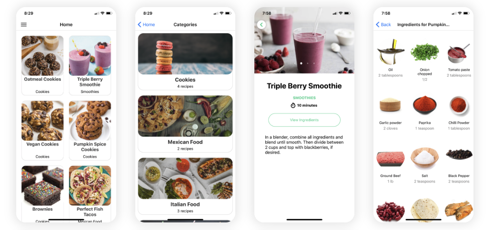

# 🍽️ React Native Recipes App

  

A beautiful and functional cross-platform **Recipe Application** built with **React Native** and **Expo**. This app helps users discover a variety of recipes categorized by meal types and ingredients, with full recipe details and images.

## 📱 Features

- 🍲 Browse popular recipes with images
- 📚 View detailed instructions and ingredients
- 🔍 Search for recipes by keywords
- 📦 Clean and modular component-based architecture
- 📱 Fully responsive across Android and iOS devices
- 🌈 Modern UI/UX with consistent theming

## 🛠️ Tech Stack

| Category        | Technology               |
|----------------|--------------------------|
| Language        | JavaScript               |
| Framework       | React Native             |
| Platform        | Expo                     |
| State Handling  | useState, useEffect      |
| API Integration | TheMealDB (or local JSON)|
| Styling         | StyleSheet API           |
| Navigation      | React Navigation         |

---

## 📁 Folder Structure

react-native-recipes-app/
├── assets/ # App assets (images, fonts)
├── components/ # Reusable UI components
│ ├── CategoryCard.js
│ ├── RecipeCard.js
├── screens/ # Screen views
│ ├── HomeScreen.js
│ ├── RecipeDetailScreen.js
│ ├── SearchScreen.js
├── navigation/ # Navigation config
│ └── AppNavigator.js
├── App.js # Entry point
├── app.json # App config
└── package.json

---

## 🤝 Collaborators

| Name | GitHub | Email |
|------|--------|-------|
| Jaivanth | [@Jaivanth9](https://github.com/Jaivanth9) | jaivanthkoppula999@gmail.com |
| Renusree | [@renusree1003](https://github.com/renusree1003) | renusreemalapati@gmail.com |
| Jagadeesh | [@Jagadeesh01](https://github.com/renusree1003) | jagadeeshtambha@gmail.com |

---

## 🚀 Getting Started

### 1. Clone the Repository

git clone https://github.com/Jaivanth9/Recipe-Manager.git

cd Recipe-Manager

### 2. Install Dependencies

npm install
or
yarn install
### 3. Run the App

Start the Expo development server:

npm start
 or
expo start
Scan the QR Code with Expo Go (Android/iOS) or use an emulator.

## 🌐 API Integration
This app can be integrated with TheMealDB for live data or use static JSON for offline support.

API Sample Endpoint:

https://www.themealdb.com/api/json/v1/1/search.php?s=chicken

Replace hardcoded data with dynamic fetch using fetch() or axios.

## 🧪 Future Improvements

✅ Add favoriting functionality

🔐 User authentication with Firebase

🛒 Shopping list generator from ingredients

🌍 Multi-language support

☁️ Remote recipe sync with cloud storage

## 👨‍💻 Author

Jaivanth Koppula

📧 jaivanthkoppula999@gmail.com
